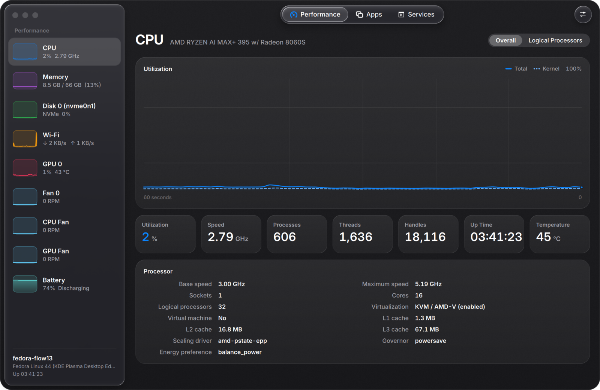
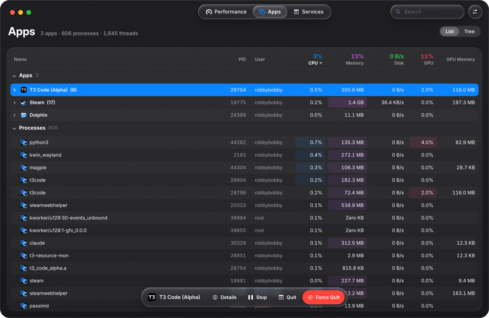
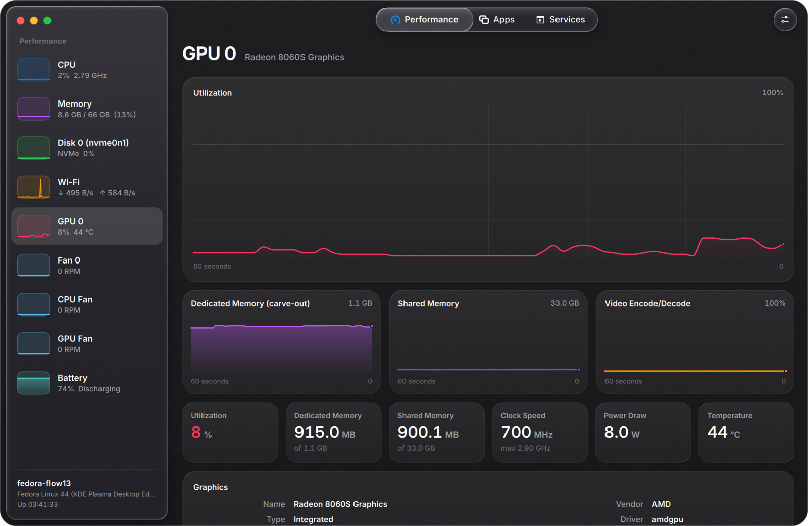
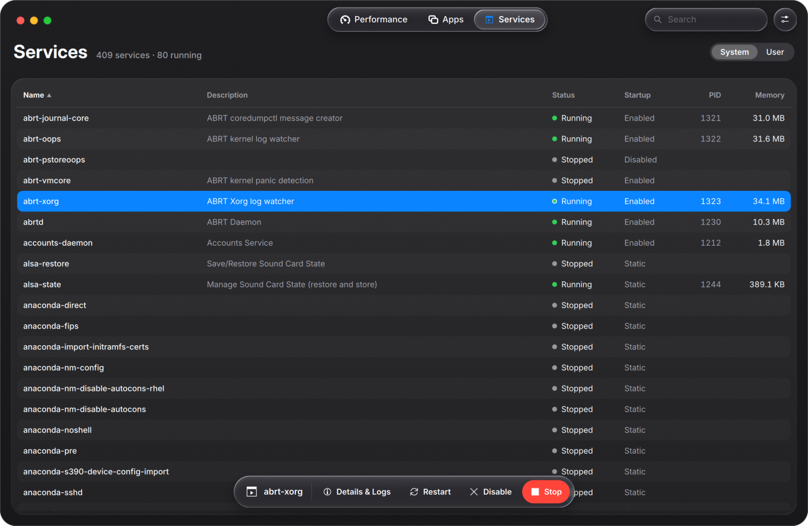
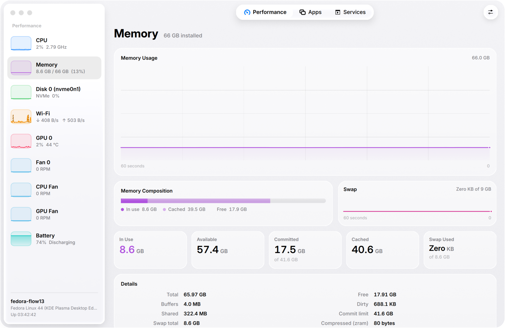

# Mission Center — Liquid Glass edition

A KDE / Qt Quick re-imagining of [Mission Center](https://gitlab.com/mission-center-devs/mission-center),
designed as if Apple had built it: a see-through window over KWin's blur, floating Liquid Glass
navigation, big confident type, soft translucent cards and springy motion throughout. Its data comes
from Mission Center's own engine, magpie.



| | |
|---|---|
|  |  |
|  |  |

## What's inside

Everything Mission Center shows, on a new frontend:

- **Performance** — CPU (overall or per logical processor), memory and composition, every disk
  (active time, transfer rate, volumes), Wi‑Fi/Ethernet (throughput, SSID, signal, band, addresses),
  GPUs (utilization, dedicated + shared memory, clocks, power, temperature), fans and batteries.
  Each device gets a live sparkline in the sidebar; graphs are smooth, GPU-rendered and have a
  hover readout.
- **Apps** — apps grouped from their systemd scopes and matched to `.desktop` entries, plus every
  process (list or tree), with live CPU / memory / disk / GPU columns, heat shading, search,
  Stop / Continue / Quit / Force Quit and a details sheet.
- **Services** — system or user systemd units with status, startup type, PID and memory; start,
  stop, restart, enable, disable (via polkit) and a journal viewer.
- **KDE integration** — real blur-behind from KWin, Kirigami icons from your icon theme, your KDE
  accent colour, System Settings shortcuts (network, power), native Wayland move/resize.

## Design notes

- **Liquid Glass** (`shaders/glass.frag`) is a real refractive material, not a blur + opacity.
  The window's content is rendered into a layer; glass surfaces sample it at their screen position
  (derived in the vertex stage), frost it with a mip-biased golden-spiral blur, bend it through a
  convex rim (with slight chromatic dispersion), boost vibrancy, and add a specular hairline that
  catches light on opposite edges.
- Following Apple's guidance, glass is reserved for the **navigation layer** — sidebar, toolbar
  controls, the floating action bar, menus and sheets. Content sits on quieter translucent cards
  (`shaders/panel.frag`) so it stays legible.
- The window **background** is glass too: a neutral translucent tint over KWin's blur of whatever is
  behind the window (`native/`, `effects.py`), like a macOS window. "Wallpaper" (a subtle tint from
  the Plasma wallpaper) and "Solid" are alternatives; without KWin's blur it falls back to solid.
- Apple system colours, concentric corner radii, Inter / Inter Display typography with tabular
  figures, "traffic light" window controls, capsule controls and spring animations.
- Settings: appearance (auto/light/dark), accent colour (multicolour or one hue), Clear vs Tinted
  glass, Reduce Transparency, update interval, graph history, units, and an option to use KDE's own
  window decorations instead of the custom chrome.

## Data engine

When built, the app runs Mission Center's own collector, **magpie** (`../subprojects/magpie`), exactly
as the GTK app does. `magpie-bridge/` is a small Rust helper that starts magpie on a private nng
socket and relays its protobuf IPC as JSON lines; `backend/magpie.py` maps the replies onto the UI.
That brings nvtop-based GPU data (encode/decode, per-process GPU use for every vendor), SMART-capable
disk info, battery history and Mission Center's app detection, at a fraction of the CPU cost.
Without the native build, pure-Python collectors (`backend/collectors.py`, `processes.py`) take over;
services always use systemd over D-Bus. Settings → Performance shows which engine is running.

## Running

Dependencies (use your distribution's packages so PySide6 and Kirigami share one Qt):

| Distro | Packages |
|---|---|
| Fedora | `python3-pyside6 python3-psutil python3-dbus kf6-kirigami` |
| Arch | `pyside6 python-psutil python-dbus kirigami` |
| openSUSE | `python3-pyside6 python3-psutil python3-dbus-python kf6-kirigami` |
| Debian/Ubuntu | `python3-pyside6.qtquick python3-pyside6.qtquickcontrols2 python3-psutil python3-dbus qml6-module-org-kde-kirigami` |

Optional native parts — KWin blur and the magpie engine (Fedora package names):
`cmake gcc-c++ qt6-qtbase-devel kf6-kwindowsystem-devel rust cargo gcc pkgconf-pkg-config libdrm-devel mesa-libgbm-devel systemd-devel`

```sh
./build-native.sh                # optional: KWin blur helper + magpie + bridge
./missioncenter-glass            # run from the checkout
./install.sh                     # install for your user (~/.local); builds the native parts if it can
./install.sh --uninstall
```

Useful flags: `--page apps|services`, `--device memory|disk:nvme0n1|net:wlp…`,
`--theme light|dark`, `--screenshot out.png`. Shortcuts: <kbd>Ctrl</kbd>+<kbd>1</kbd>/<kbd>2</kbd>/<kbd>3</kbd>
switch pages, <kbd>Ctrl</kbd>+<kbd>F</kbd> search, <kbd>Ctrl</kbd>+<kbd>,</kbd> settings,
<kbd>Delete</kbd> quits the selected app, <kbd>Esc</kbd> clears the selection.

## Layout

```
missioncenter_kde/
  app.py            bootstrap: fonts, QML engine, screenshot mode
  bridge.py         Monitor: sampler threads → graph histories + models for QML
  models.py         sidebar devices, apps/process tree, services (positional list models)
  wallpaper.py      finds the Plasma wallpaper
  effects.py        KWin blur-behind via the native helper
  backend/          magpie adapter + fallback collectors for /proc, /sys, NetworkManager, systemd
  qml/MissionCenter design system (Theme, Glass*, Card, Graph…) and pages
  shaders/          GLSL sources + compiled .qsb packs (./build-shaders.sh to rebuild)
  fonts/            Inter (SIL OFL)
native/             C++ helper wrapping KWindowEffects (blur-behind)
magpie-bridge/      Rust JSON bridge to magpie
tools/              patch-via-git.sh (lets magpie build without GNU patch)
```

The original GTK application in the repository root is untouched.

## Licence

GPL-3.0-or-later, like Mission Center. Inter is © The Inter Project Authors, under the SIL Open
Font License (`missioncenter_kde/fonts/Inter-LICENSE.txt`).
