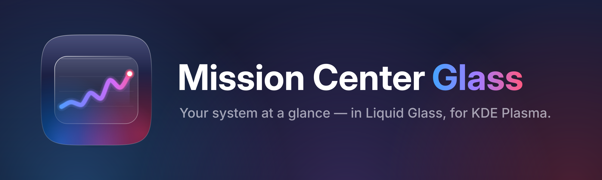

# Mission Center Glass — brand

**Name.** *Mission Center Glass* in full; *Mission Center* only where the context already says
Glass (for example inside the app). Never "MC Glass" or "Glass".

**Tagline.** "Your system at a glance — in Liquid Glass, for KDE Plasma."

**Icon** (`icon.svg`, generated by `make_icon.py`). An Apple-style continuous-corner squircle
(superellipse, n = 5) in a deep night gradient, lit from below in the device colours; on it a
frosted glass panel carrying a rising live-activity line that ends in a glowing dot. Built from
gradients and plain strokes only, so KDE's icon loader (Qt SVG) renders it exactly like a
browser. Minimum comfortable size: 22 px.

**Palette.** The app's Apple system colours; the brand gradient runs blue → violet → pink.

| Role | Hex |
|---|---|
| Brand blue | `#46A3FF` (UI: `#0A84FF` dark / `#007AFF` light) |
| Brand violet | `#A37BFF` (UI purple `#BF5AF2`) |
| Brand pink | `#FF5A82` (UI pink `#FF375F`) |
| Night (icon/banner ground) | `#2B3163` → `#161A38` → `#0A0B1A` |

**Type.** Inter Display Bold for the wordmark and titles, Inter for text (bundled in
`missioncenter_kde/fonts`). In the wordmark, "Glass" carries the brand gradient.

**Regenerating.** `python3 branding/make_icon.py && cp branding/icon.svg
missioncenter_kde/icons/io.missioncenter.MissionCenter.Glass.svg`, then
`python3 branding/make_banner.py`.
